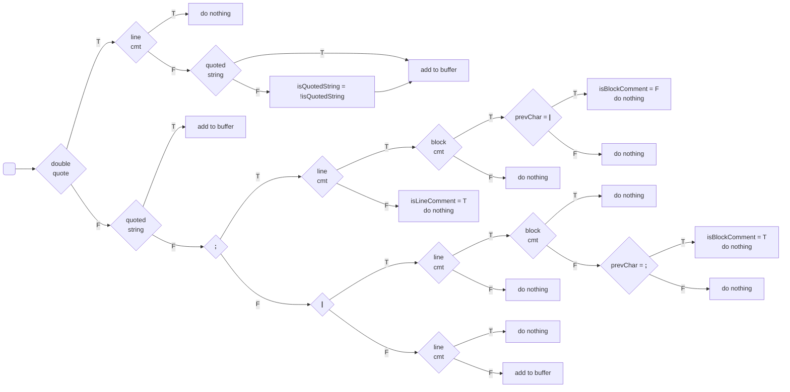

# Remove comments

This flowchart shows the basic logic behind the parsing:



Notes:
* `cmt` = comment
* `T` = true
* `F` = false
* `isQuotedString`: does the current character belong a to a quoted string?
  * `A` character belongs to a quoted string (`isQuotedStrig = true`)
  * `B` character belongs to a quoted string (`isQuotedStrig = false`)
  ```
  (princ "\nA")(B xxx xxx)
  ```